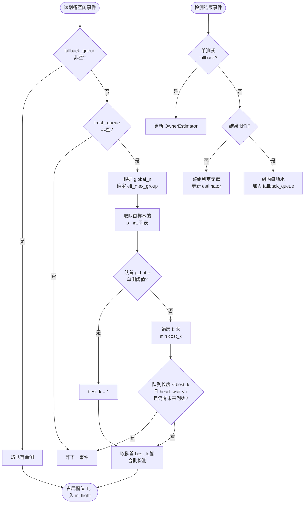

# 动态混合检测调度方案设计文档

> 配套实现：[pooled_test_abtest.py](g:/v_stable_code/pooled_test_abtest.py)

---

## 1. 问题描述

### 1.1 业务背景

存在大量水样需要做毒性检测，每瓶水非毒即净。系统具备如下能力：

- **混合检测（pooled test）**：可以把任意子集的水样混合到一起做一次检测，结果只有阳性 / 阴性两种：
  - 全组无毒 → 阴性
  - 至少一瓶有毒 → 阳性，但**无法定位**到具体哪一瓶
- **并行试剂**：系统拥有 $M$ 个并行试剂槽，单次检测耗时为常量 $T$，检测期间槽位独占。
- **动态到达**：水样不是一次到齐，而是按时间陆续到达，到达过程近似泊松。
- **Owner 属性**：每瓶水都来自一个提交者（Owner），同一 Owner 的水样毒率相对稳定。

### 1.2 优化目标

系统的核心目标是**让每瓶水尽快得到结论**，并兼顾试剂消耗和等待公平性。统一为加权代价：

$$J = \alpha \cdot \text{平均完成时间} + \beta \cdot \text{试剂消耗} + \gamma \cdot \text{等待时间}$$

实践中以**平均完成时间**（`avg_completion`）为主指标，**单瓶平均试剂消耗**（`tests_per_sample`）和**最大等待时间**（`max_waiting`）为辅指标。

### 1.3 形式化

| 符号 | 含义 |
|------|------|
| $x_i \in \{0, 1\}$ | 第 $i$ 瓶水真实毒性，$1$ 为有毒 |
| $p_i$ | 第 $i$ 瓶水有毒的概率，未知 |
| $S$ | 一次检测选中的样本子集 |
| $y(S) = \max_{i \in S} x_i$ | 一次混检的结果 |
| $T$ | 单次检测耗时 |
| $M$ | 并行试剂槽数 |
| $\lambda$ | 样本到达率 |
| $\tau$ | 最长允许的凑批等待时间 |

---

## 2. 问题分析

### 2.1 为什么经典 Dorfman 不够用

经典 Dorfman（1943）混合检测在**所有样本一次给齐、毒率 $p$ 已知且恒定、单试剂、只优化期望试剂数**这四个假设下，给出最优组大小 $k^\star \approx 1/\sqrt{p}$。

落到本问题，每条假设都被打破：

| 经典假设 | 本问题的实际情况 |
|---------|-----------------|
| 样本一次性给齐 | 陆续到达，**在线决策** |
| $p$ 已知且恒定 | $p$ 未知；不同 Owner、不同时间都不一样 |
| 只有 1 个试剂槽 | $M$ 个并行槽，可同时跑多组 |
| 优化期望试剂数 | 真正在意的是**完成时间** |
| 所有样本同质 | Owner 维度上**天然异质** |

经典公式直接搬过来既不能在线，也没用上 Owner 信息和并行度，性能上限就被锁死了。

### 2.2 三对核心矛盾

把上面 5 条差异归纳一下，本质上是 3 对矛盾：

1. **合批省试剂 vs. 凑批拖延迟**
   组越大试剂越省，但同时阳性概率上升、凑批等待变长、阳性后拆分耗时也变长。
2. **估计要数据 vs. 决策要立刻**
   毒率必须在线估计才有意义，但试剂槽不能为了等数据空转。
3. **均匀对待 vs. 因材施教**
   忽略 Owner 信息会浪费一个免费的强先验；但完全按 Owner 调度又会破坏公平性（FIFO）。

整个方案的设计思路就是围绕这三对矛盾做取舍。

### 2.3 决策点拆分

为了让取舍可执行，把"做一次检测"这件事拆成 4 个独立的决策点：

| 决策点 | 决定的事 |
|--------|---------|
| **D1 调度时机** | 试剂槽空闲时，是立即开测，还是等更多水到达再开测？ |
| **D2 分组大小** | 这一次合批选几瓶水？ |
| **D3 估计方式** | 怎么估计每瓶水的有毒概率？ |
| **D4 阳性处理** | 合批阳性后怎么定位？ |

下文按这 4 个决策点逐一给出方案，再合到一起形成完整流程。

---

## 3. 方案设计

### 3.1 D3 — 在线估计：按 Owner 维度

> **结论**：每个 Owner 维护独立的 Beta-Binomial 后验；冷启动用全局先验回退。

每个 Owner $o$ 维护两个计数：累计阳性数 $k_o$、累计样本数 $n_o$，后验：

$$\hat{p}_o = \frac{k_o + 1}{n_o + 2} \quad (\text{Laplace smoothing})$$

**冷启动处理**：

- 当 $n_o < 3$，把全局后验作为先验加权融合，避免 Owner 早期方差过大；
- 当全局也不够样本（`global_n < cold_start_n`），把分组上限收紧到 `cold_start_max_group`，防止"信心十足地大合批一把全阳"的灾难。

**为什么按 Owner 而不按全局**：当 Owner 之间毒率差异较大时（异质场景），全局 $\hat p$ 是一个含混的中间值，分组大小总在某个折中点上下徘徊；按 Owner 拆开后，"干净源"可以合很大组，"脏源"自然走单测，平均代价显著下降。

### 3.2 D2 — 分组大小：M-aware 时间代价最优

> **结论**：以"每瓶水期望服务时间"为代价，遍历 $k$ 取最小。

经典公式优化的是期望试剂数，本问题真正在意的是时间。把"时间"建进代价函数：

$$\text{cost}_k \;=\; \frac{T \;+\; (1 - q_k) \cdot \lceil k / M \rceil \cdot T}{k}$$

其中 $q_k = \prod_{i=1}^{k}(1 - \hat p_i)$ 是该组全阴的概率。

- **分子第一项 $T$**：合批必测一次。
- **分子第二项**：阳性概率 $1 - q_k$ × 拆分耗时 $\lceil k/M \rceil \cdot T$（拆分时占 $\lceil k/M \rceil$ 轮并行）。
- **分母 $k$**：摊到每瓶水。

从队首向后看至 `max_group` 瓶，遍历 $k$ 取使 $\text{cost}_k$ 最小的那个。**单瓶基准** $\text{cost}_1 = T$，所以当所有 $\text{cost}_k > T$ 时算法自动退化为单测——这是天然的安全底。

**高毒率逃逸**：队首 $\hat p_o \geq$ `single_test_threshold`（默认 0.35）时直接 $k=1$。这是因为估计本身有方差，硬规则比柔性公式在边界更稳。

### 3.3 D1 — 调度时机：着急型 + 软等待

> **结论**：试剂一空就调度（FIFO）；只在"队列不足、又有未来到达"时短暂软等待。

**着急型规则**：试剂槽空闲且队列非空 → **立刻调度**，按 FIFO 取队首，让 D2 决定 $k$。

**理由**：

- 凑批等待会直接计入每个样本的 `waiting_time`；
- 动态到达下，"硬等够 $k$ 瓶"会让队列起伏放大，反而拉高 max_waiting；
- 试剂空闲不测纯粹是浪费产能。

**软等待 Tau**：只在以下条件全部成立时短暂保留试剂：

- 队列长度 < 当前前瞻最优 $k$
- 队首已等待 < $\tau$
- 后续仍有未来到达

任意条件破掉立刻派发。$\tau$ 的物理含义是**单瓶水愿意为合批多等的最长时间**。这个机制覆盖稀疏到达场景——避免被迫单测、永远没机会合批。

**FIFO 是硬约束**：不按毒率排序合批，理由：
- 公平性：先到先得是业务底线；
- 防饿死：高毒率 Owner 的水不会被无限延后；
- 可解释：调度顺序与到达顺序一致，便于排查。

### 3.4 D4 — 阳性处理：单层 Fallback

> **结论**：合批阳性 → 该批每瓶水进入 `fallback_queue` 逐瓶单独复测。

**为什么不做多层二分递归**：

- 二分递归是**串行链**：上一层结果出来才能决定下一层，最坏 $O(\log k)\cdot T$；
- 在 $M$ 个并行槽场景下，二分递归"一拆为二再串行"反而浪费并行度；
- 实现复杂、出错点多。

**单层 fallback 的优势**：

- 阳性后 $k$ 瓶水一次性进入单测队列，**$M$ 个槽可同时跑**，墙钟时间 $\lceil k/M \rceil \cdot T$；
- 实现简单、与 D2 的代价模型 $\lceil k/M \rceil \cdot T$ 严格对齐；
- **任意样本最坏服务时间不超过 $2T$**（一次合批 + 一次单测）。

---

## 4. 完整方案流程

### 4.1 数据结构

```
fresh_queue       : FIFO 队列，所有未开始检测的样本
fallback_queue    : FIFO 队列，已知阳性组拆出来的样本，优先级最高
in_flight         : 最小堆，正在试剂槽中的检测任务，按结束时间排序
slots[1..M]       : 每个试剂槽的下次空闲时刻
estimator         : OwnerEstimator，每个 Owner 维护 (k_o, n_o)
```

### 4.2 主循环

每个事件点（试剂槽空闲、新样本到达、检测结束）触发一次调度：

```
while 还有未完成的样本:
    while 试剂槽空闲且能派发:
        try_dispatch_one()
    推进时间到下一个事件点（最近的到达 或 最近的检测结束）
    若是检测结束 → resolve_group()
```

### 4.3 派发逻辑 `try_dispatch_one`

```
1. 选最早空闲的槽 slot_idx，时间 t_now = max(slot 空闲时刻, now)
2. 把所有 arrival_time ≤ t_now 的样本灌进 fresh_queue
3. 优先级 1：fallback_queue 非空 → 取队首单测，end
4. fresh_queue 为空 → 返回 False（什么都不做）
5. 取冷启动后的实际分组上限 eff_max_group
6. 取队首 eff_max_group 瓶水的 p_hat 列表 head_p_hats
7. 高毒率逃逸：head_p_hats[0] ≥ single_test_threshold → best_k = 1
   否则：调用 _expected_cost_per_sample 求 best_k
8. Tau 软等待判定：
     若 len(fresh_queue) < best_k
        且 head_wait < tau
        且 还有未来到达
     → 返回 False（保留槽位等一会儿）
9. grp_size = min(best_k, len(fresh_queue))
   从 fresh_queue 头部取 grp_size 瓶组成 group
   占用槽位到 t_now + T，入 in_flight
```

### 4.4 结算逻辑 `resolve_group`

```
1. 若是单测（fallback 或 grp_size=1）：
     直接得到结论，更新 OwnerEstimator
2. 否则混检：
     全阴 → 整组判定无毒，所有样本更新 estimator
     有阳 → 该批每瓶水加入 fallback_queue（保持 FIFO 顺序）
```

### 4.5 Mermaid 流程图



---

## 5. 参数说明

### 5.1 Owner 模型参数

| 参数 | 含义 | 推荐范围 |
|------|------|---------|
| `n_owners` | Owner 数量 | 4 ~ 20 |
| `pop_mu` | Owner 平均毒率的总体均值 | 0.05 ~ 0.3 |
| `pop_sigma` | Owner 之间的差异 | 同质场景小、异质场景大 |
| `owner_sigma` | 同一 Owner 内样本毒率波动 | 0.005 ~ 0.02 |

### 5.2 系统参数

| 参数 | 含义 | 推荐范围 |
|------|------|---------|
| `M` | 并行试剂槽数 | 1 / 2 / 4 |
| `T` | 单次检测耗时 | 归一化为 1.0 |
| `arrival_rate` | 到达率 $\lambda$ | 0.3（稀疏） ~ 5.0（爆发） |
| `tau` | 软等待上限 | 1 ~ 3 |

### 5.3 算法内部参数

| 参数 | 含义 | 默认值 |
|------|------|-------|
| `p_init` | 冷启动毒率先验 | 0.15 |
| `max_group` | 合批上限 | 16 |
| `cold_start_n` | 多少观测后解锁正常分组 | 20 |
| `cold_start_max_group` | 冷启动期分组上限 | 3 |
| `single_test_threshold` | 高毒率逃逸阈值 | 0.35 |

---

## 6. 实验与数据分析

### 6.1 对照组

| 策略 | 思路 |
|------|------|
| **Baseline** | 每瓶水单独检测，性能下界 |
| **Adaptive** | 全局 $\hat p$ + Dorfman 二分递归（经典对照） |
| **Eager** | 本方案：Owner-aware + 着急调度 + M-aware 前瞻 + 单层 Fallback |

### 6.2 输出指标

| 指标 | 定义 |
|------|------|
| `makespan` | 全部样本完成总跨度 |
| `avg_waiting` / `max_waiting` | 等待时间（开始检测 − 到达） |
| `avg_completion` / `max_completion` | 完成时间（结束 − 到达） |
| `total_tests` | 试剂消耗总次数 |
| `tests_per_sample` | 单瓶平均消耗（合批效益核心指标） |
| `throughput` | $N / \text{makespan}$ |

### 6.3 ABTest 场景矩阵

10 个内置场景覆盖三个维度：

| 维度 | 场景 |
|------|------|
| 毒率 / 同质度 | `homo_low_p`, `homo_mid_p`, `homo_high_p`, `hetero_wide`, `hetero_extreme`, `few_owners_mixed` |
| 资源稀缺度 | `M=1_hetero`, `M=4_hetero` |
| 到达模式 | `burst_hetero`（$\lambda = 5$）, `sparse_hetero`（$\lambda = 0.3$） |

### 6.4 预期结论

| 场景 | 预期表现 |
|------|---------|
| 低毒率（$p \leq 0.1$）+ 中等到达 | Eager 在 `tests_per_sample` 上节省 40%~60%，`avg_completion` 显著低于 Baseline |
| 异质 Owner | Eager 优于 Adaptive，因为 Owner-aware 可识别"干净源"和"高风险源"，分组质量更高 |
| 高毒率（$p \geq 0.3$） | 合批收益消失，Eager 通过高毒率逃逸退化为 Baseline，**不会变差** |
| 稀疏到达 | Tau 软等待让 Eager 不会盲目单测，在等待可控的前提下保留合批收益 |
| 资源紧张（$M = 1$） | Adaptive 的串行二分链劣势放大；Eager 通过单层 fallback 保持优势 |
| 资源充裕（$M = 4$） | 三者差距缩小，但 Eager 仍在 `tests_per_sample` 上领先 |

### 6.5 用法

```bash
python ./pooled_test_abtest.py
```

修改场景：编辑 `main()` 中的 `scenarios` 列表。

---

## 7. 后续扩展方向

| 方向 | 说明 |
|------|------|
| 毒率非平稳 | 当前 OwnerEstimator 是无衰减累计；若毒率漂移可改为滑窗或指数衰减 |
| 多层 Fallback | $M = 1$ 且 $k$ 很大时，二分递归在墙钟时间上可能优于单层 |
| 软聚合 | 在不破坏 FIFO 的前提下，把"同 Owner 优先合到一组"作为软偏好 |
| 自适应 Tau | 把 $\tau$ 做成关于 $\lambda$ 与 $\hat p$ 的函数，而不是固定常数 |

